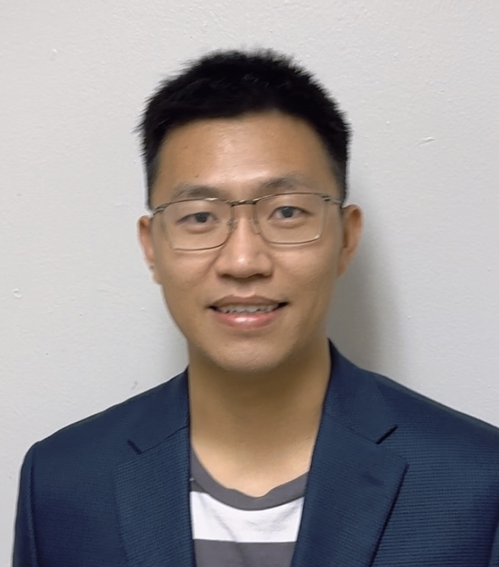

 **We are  looking for new PhD students and research interns to join the team**

## RAs

<table>
  <tr>
    <td valign="top">

### Milan P Allan

- **Position:** Associate Professor, started Jan 2015
- **Education:**
  - Master ETHZ, Diplomarbeit with J Osterwalder, University of Zurich
  - PhD St Andrews (while at Cornell University) with Felix Baumberger and JC Davis
- **Experience:**
  - Postdoc Cornell
  - ETH fellow at ETHZ with Andreas Wallraff
- **Awards:**
  - Bryan R. Coles Prize 2017

    </td>
    <td valign="top">

### Yudai Sato

- **Position:** Postdoc, started September 2023
- **Education:**
  - PhD with Yukio Hasegawa at the University of Tokyo
  - Master, University of Tokyo

    </td>
  </tr>
  <tr>
    <td valign="top">

### Jiasen Niu

- **Position:** Postdoc, started Oct 2020
- **Education:**
  - PhD with Xi Lin and Jian Wei, Peking University
  - BSc Jilin University

    </td>
    <td valign="top">

### Tjerk Benschop

- **Position:** Postdoc, since 2023
- **Education:**
  - PhD Student, 2018-2023
  - Master Leiden University with Milan Allan
- **Fellowships:**
  - Casimir PhD fellowship

    </td>
  </tr>
</table>

### Feng Liu

- **Position:** Postdoc,  
- **Education:**
  - PhD with  