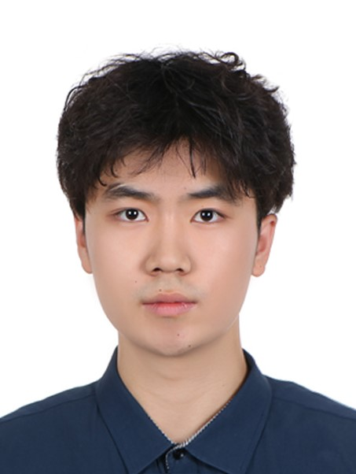

 **We are  looking for new PhD students and research interns to join the team**

## PhD students

<table style="margin-left: auto; margin-right: auto;">
  <tr>
    <td valign="top" align="center" style="padding-right: 20px; padding-bottom: 20px;">
       
      <strong>Recruiting now</strong> 
    </td>
    <td valign="top" align="center" style="padding-right: 20px; padding-bottom: 20px;">
       
      <strong>Recruiting now</strong> 
    </td>
    <td valign="top" align="center" style="padding-bottom: 20px;">
       
      <strong>Recruiting now</strong> 
    </td>
  </tr>
</table>

 <!-- Horizontal line for visual separation -->

## RAs/Interns

<table style="margin-left: auto; margin-right: auto;">
  <tr>
    <td valign="top" align="center" style="padding-right: 20px; padding-bottom: 20px;">
       
      <strong>Behafarin Emam</strong> 
      <strong>Topic:</strong> WiFi data-based 3D human modeling 
      <strong>Master,</strong> Drexel University 
      be379@drexel.edu 
    </td>
    <td valign="top" align="center" style="padding-right: 20px; padding-bottom: 20px;">
       
      <strong>Rui Xia</strong> 
      <strong>Topic:</strong> Traffic scenario generation 
      <strong>Master,</strong> University of Pennsylvania 
      xia7@seas.upenn.edu 
    </td>
    <td valign="top" align="center" style="padding-bottom: 20px;">
       
      <strong>Kiran Shidruk</strong> 
      <strong>Topic:</strong> Person ReID 
      <strong>Master,</strong> Drexel University 
      kus26@drexel.edu 
    </td>
  </tr>

  <tr>
    <td valign="top" align="center" style="padding-right: 20px;">
       
      <strong>Ziang Gu</strong> 
      <strong>Topic:</strong> 4D motion planning and generation 
      <strong>Undergraduate,</strong> Michigan State University 
      guziang@msu.edu 
    </td>
    <td valign="top" align="center" style="padding-right: 20px;">
       
      <strong>Shengyang Dong</strong> 
      <strong>Topic:</strong> Discriminative 3D human digitization 
      <strong>Undergraduate,</strong> Drexel University 
      sd3666@drexel.edu 
    </td>
    <td valign="top" align="center" style="padding-bottom: 20px;">
       
      <strong>Safa Obuz</strong> 
      <strong>Topic:</strong> 3D scene/object reconstruction 
      <strong>Undergraduate,</strong> Drexel University 
      seo52@drexel.edu 
    </td>
  </tr>

  <tr>
    <td valign="top" align="center" style="padding-right: 20px;">
       
      <strong>Mustafa Bookwala</strong> 
      <strong>Topic:</strong> DeepFake Detection 
      <strong>Undergraduate,</strong> Drexel University 
      mmb479@drexel.edu 
    </td>
  </tr>
</table>

